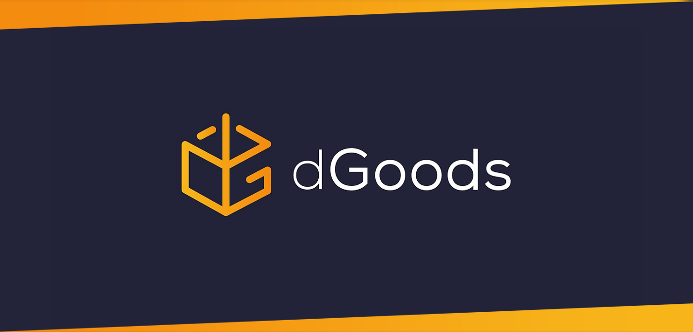

.. _contract-dgoods:

===========================================
dGoods
===========================================

.. note::

  A brief introduction of dGoods

`dGoods <https://github.com/MythicalGames/dgoods>`_ is an open source 
and free standard for handling all types of 
virtual items on the EOS blockchain.
It is led by `Mythical Games <https://mythical.games/>`_
to provide a robust digital goods standard 
that supports a diverse and innovative development community. 

dGoods is a logical extension of the standard EOS token with the addition 
of significant functionality improvements that will allow teams to easily 
integrate and display virtual items. With the dGoods standard, you get a 
framework that works with all types of digital assets that you might need 
for your dApps.

Three most important properties of dGoods which differentiate from other 
token standards

- Hierarchical naming structure of ``category:name`` for each token or set of 
  tokens, enabling filtering and organization of tokens

- Focus on semi-fungible tokens - that is, tokens that are 1 of n with
  a serial number or slightly different metadata

- Open source metadata types and standardization for each type 
  with localization, e.g. ``3dGameAsset``, ``Ticket``, etc

.. toctree::
  :hidden:

  quickstart
  standard
  contracts
  exchange
