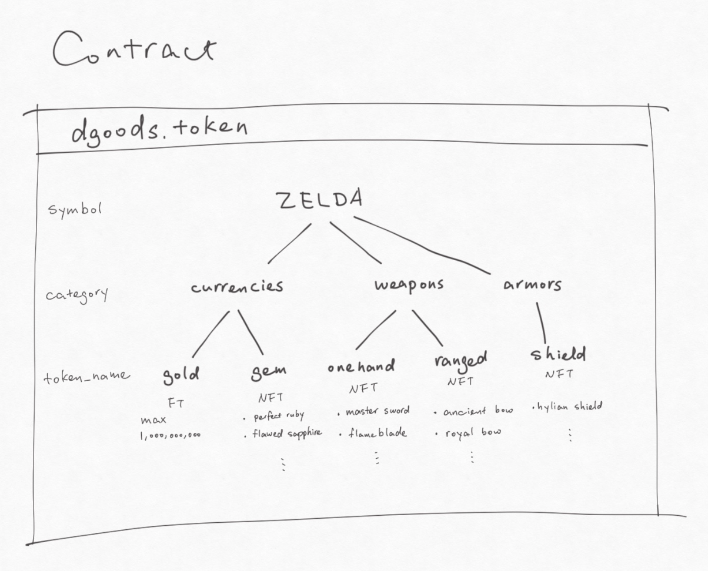

===========================================
dGoods Standard
===========================================

.. note::

  This section will explain the dGoods standard in details.  
  We referred the dGoods release Medium article but rewrote some parts.
  
  We will probably add more details about how the features are 
  implemented in dGoods. Some figures and code snippets might
  be helpful for better understanding.

The digital goods landscape is as diverse as it gets, so 
dGoods provide a flexible and comprehensive standard 
that could address a diverse range of digital item requirements.

Multiple categorized tokens in one contract
-------------------------------------------

In a world where digital goods will be a major commodity, being able 
easily and efficiently manage large quantities of items is critical.
Other token standards have one token with one contract. If a developer 
wants to issue different types of tokens, it has to be done through 
multiple contracts. This not only increases complexity but also cost. 

To address this, the dGoods standard implements a `hierarchical 
naming structure`, which has one token symbol per contract
but allows the creation of many sub-tokens. 

Each sub-token can be 
assigned a category, a token name, and tags which will allow wallets, 
exchanges and dApps to organize, filter, and display tokenized assets 
with ease. All of this can then be packed into one single transaction, 
allowing for developers and users to move groups of tokens around 
quickly and efficiently.

Fungible, non-fungible, and semi-fungible
-------------------------------------------

`Fungible tokens` refers to tokens which are interchangeable like EOS itself. 
When tokens are fungible, each of their individual units are equivalent
and they are indistinguishable among themselves.

A `non-fungible token` (NFT) is a special type of token which represents 
something unique; non-fungible tokens are thus not interchangeable.
NFTs are used in several specific applications that require unique 
digital items like crypto-collectibles and crypto-gaming. Popular 
blockchain games like CryptoKitties make use of non-fungible tokens 
on the Ethereum blockchain.

NFTs can be used to represent in-game assets that are controlled 
by the user instead of the game developer. This lets 
the assets be traded on third-party marketplaces without permission from 
the game developer. NFTs also find potential use in digital art, by helping 
prove authenticity and ownership.

`Semi-fungible tokens` are technically unique in that they have a unique 
identifier, but may share the same or similar data to other tokens. 
Many physical goods would fall into this category as they have a unique 
serial number but otherwise are indistinguishable.

As a standard for tokenized digital goods, a single focus on NFT standards 
was not enough. A game or company will want to create many different tokens, 
some of them being fungible or semi-fungible while others being non-fungible.
Since the dGoods standard has the benefit of defining sub-tokens within one 
contract, it gives developers the freedom to make some of them fungible and 
others non-fungible.

.. todo::

  A diagram to demonstrate how NFT and FT fit in a category. Should have
  more details to explain how they are structured in dGoods standard.

Fungible tokens are identified by ``symbol:category:name`` 
and NFTs have an extra token id associated. This allows for unprecedented 
organization of tokens. It also enables wallets and dApps to surface tokens 
by category or name, providing search and filtering functionality.

Certificate of Authenticity
-------------------------------------------

True ownership is at the heart of the new player-owned economy that’s 
emerging from blockchain technology. With the certificate of authenticity, 
we provide developers an additional way to integrate proof of ownership 
into their tokenized digital goods.

Like with physical real-world objects, digital objects need a certificate 
of authenticity. In order to support a thriving economy of digital goods, 
it’s critical we give consumers confidence in their purchases. Built into 
dGoods is the ability to have immutable fields describing the object’s 
attributes that make up the certificate of authenticity. This will also 
allow developers to display a graphical representation to consumers as 
proof of the item’s attributes including things like its brand, creator, 
or rarity.

Metadata Templates
-------------------------------------------

Part of the dGoods standard involves specifying templates for metadata 
depending upon the type of digital good you’re working with. If the token 
is for a game, coupon, ticket, music file, piece of art, etc., standard 
templates can be created so that wallets will be able to render and display 
the relevant information, images, and even 3d objects. This allows for a 
wide array of digital asset types to be supported while providing the 
development community a flexible toolset to work with.

.. todo::

  some examples for templates

Decentralized Exchange
-------------------------------------------

One of the biggest features of dgoods is the built in exchange.

Open Source
-------------------------------------------

The dGoods standard is an open and free standard initially for the EOS 
development community but is open for other blockchains to adopt. The 
standard will roll out first on the EOS mainnet. No other tokens are 
required to use the standard.
dGoods looks leverage the strengths of blockchain, 
capitalizing on concepts like verifiable scarcity, and allowing for the 
emergence of thriving embedded secondary marketplaces.
