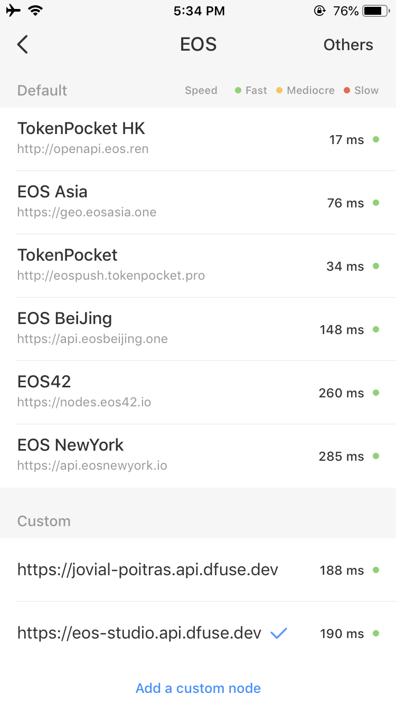
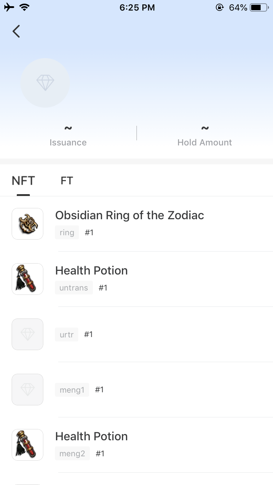
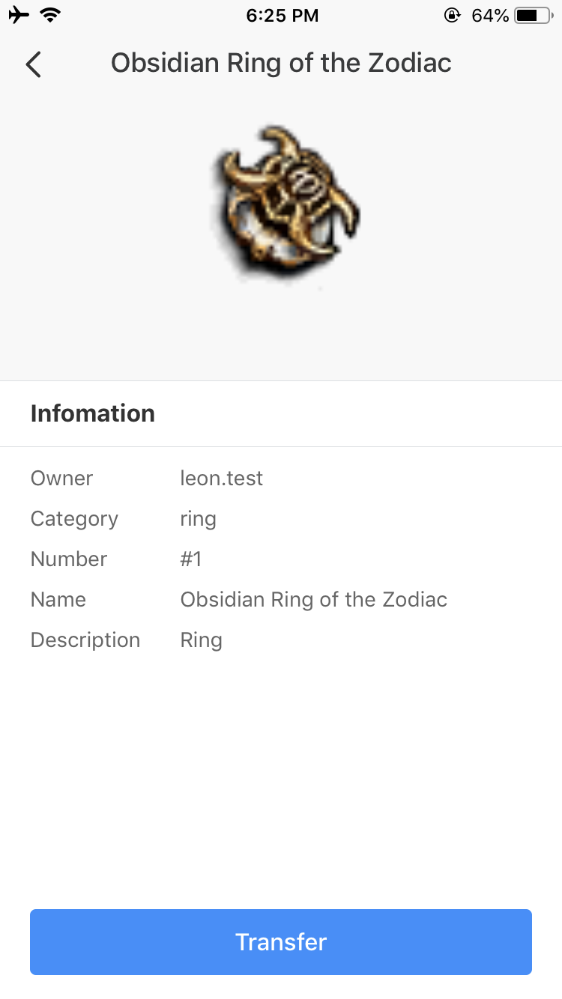
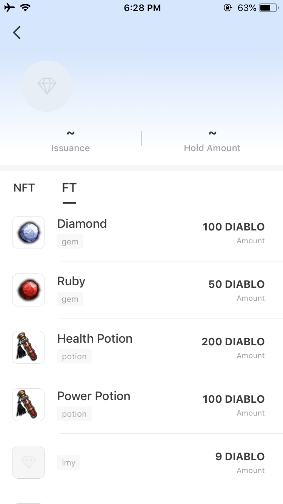
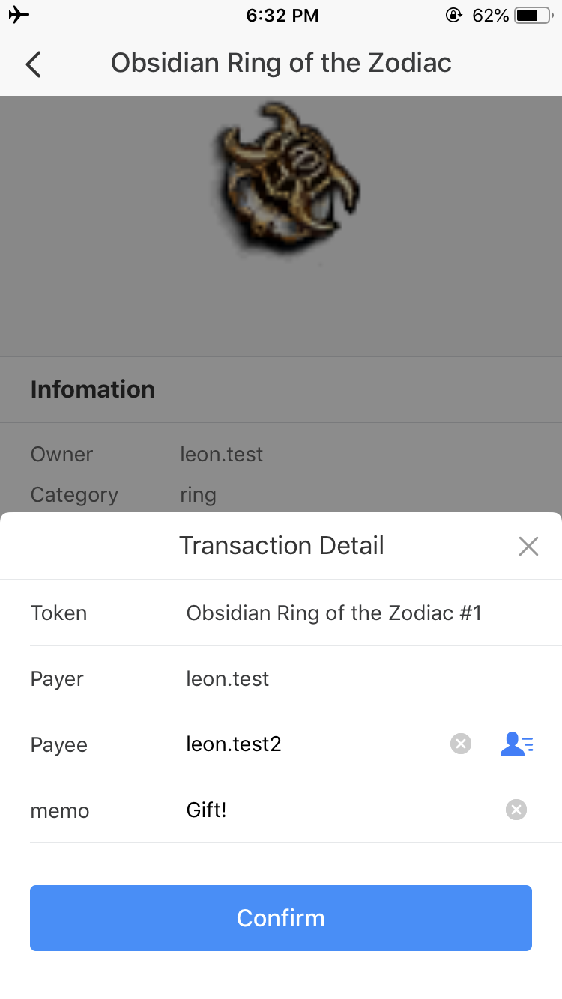
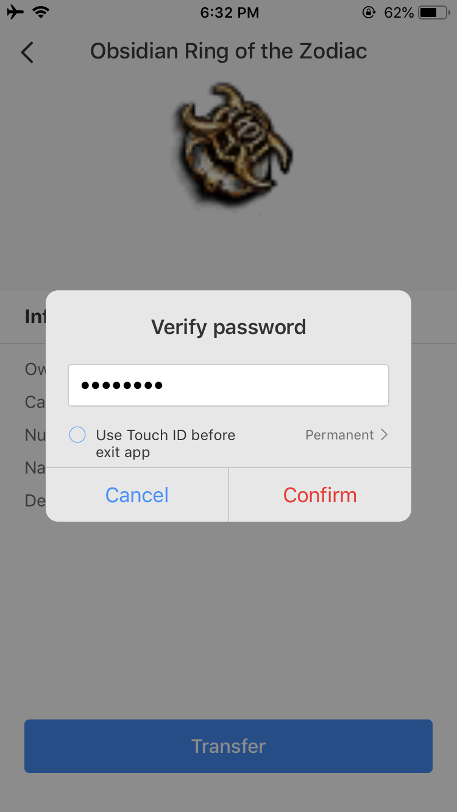

===========================================
dGoods in Wallets
===========================================

As a open sourced standard, dGoods provides a protocol that xxx
xxx for wallets to support dGoods standard.
`TokenPocket <https://www.tokenpocket.pro>`_
is a xxxx that already supports the dGoods standard.

We will continue from the previous section

Preparations
===========================================

**1. Connect to EOS Studio's Cloud-hosted network**

  - Open TokenPocket and go to Me -> Settings -> Nodes Setting
  - Add a custom node under the Custom section: ``https://eos-studio.api.dfuse.dev``

**2. Enable Developer Mode**

  - Open TokenPocket and go to Me -> About Us, 连续点击 Token Pocket 图标 8 次，
    开发者模式的对话框弹出，勾选并点击 Understood
  .. image:: tp-dev-aboutus.png
    :width: 30%
  .. image:: tp-dev-agreement.png
    :width: 30%

  - 列表中新增 Developer Mode，点击进入 Developer Mode 并开启 dGoods 选项
  .. image:: tp-dev-list.png
    :width: 30%
  .. image:: tp-dev-dgoods.png
    :width: 30%

**3. Import accounts**

  - Open the :ref:`keypair manager <Keypair Manager>` in EOS Studio 
    and export the private keys you used to create ``demonhunter`` and ``necromancer`` 
    (or accounts you used to own dGoods).

  - Open TokenPocket and go to Assets, click I have an account.
  - 选择 Private Key 导入
  - 将 EOS Studio 中获取的 private key 粘贴进最上方输入框
  - 按下方提示依次填入密码等，在 Account(Developer Mode) 中输入你的账号名
  - 点击 Start Importing

  .. image:: tp-assets-no-account.png
    :width: 30%
  .. image:: tp-assets-add-list.png
    :width: 30%
  .. image:: tp-assets-add-details.png
    :width: 30%

**4. Add dGoods contract**

  - Go back to Assets tab 你会发现账户中已经有一些 EOS token 了
  .. image:: tp-assets-main.png
    :width: 30%
    :align: center

  - 选择 Collectibles ，目前列表为空，点击最右边的加号
  - 在弹出的窗口中填入你的 contract name 并 confirm
  - Collectibles 底下会新增 dGoods 的 contract 了

  .. image:: tp-assets-collectibles-empty.png
    :width: 30%
  .. image:: tp-assets-collectibles-add.png
    :width: 30%
  .. image:: tp-assets-collectibles-list.png
    :width: 30%

View digital assets in wallets
===========================================
现在我们可以查看我们账号底下的 dGoods 资产了

**Non-fungible tokens**

**Fungible tokens**

.. image:: tp-ft-details.png
  :width: 30%

Make Transfers
===========================================

- 点击进入某个 NFT 详情
- 点击详情底下的 Transfer
- 在 Payee 中填写接收人，点击 Confirm 后输入密码

