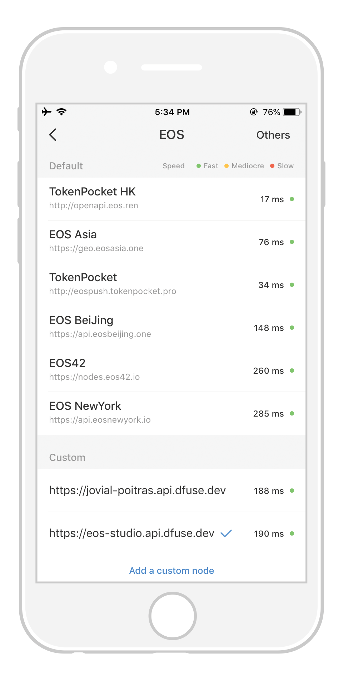
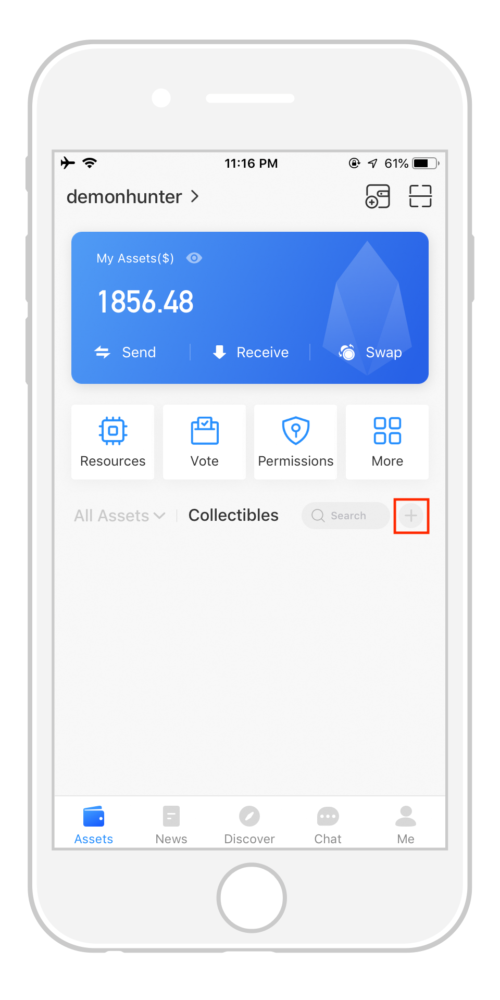
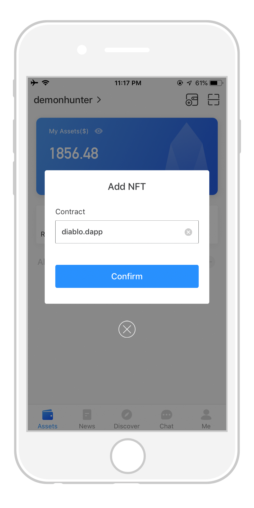
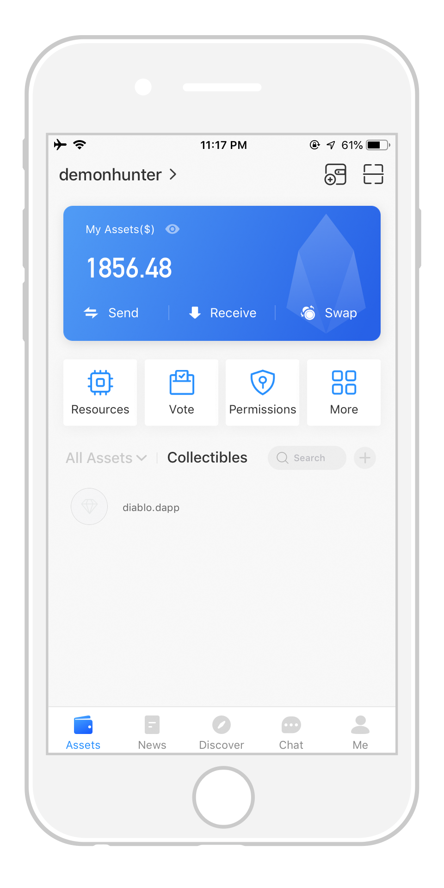
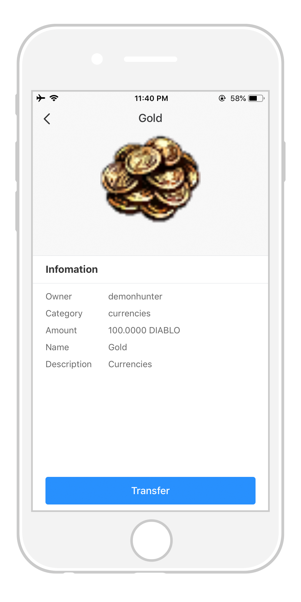
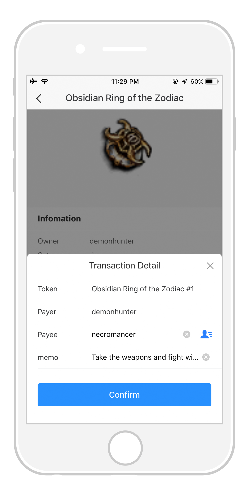

===========================================
dGoods in Wallets
===========================================

As a open sourced standard, dGoods provides a protocol that 3rd-party
wallet can implement to provide the features of dGoods. Users will be
able to visualize the digital assets issued under the standard and 
make transactions for them. In this section, we will show how to do
that using `TokenPocket <https://www.tokenpocket.pro>`_,
one of the first wallets support dGoods.
We will continue from the previous section, so make sure you already
followed it and issued some digital assets.

Preparations
===========================================

-------------------------------------------
1. Enable dGoods in developer mode
-------------------------------------------

- Open TokenPocket and go to *Me -> About Us*.
- Tap the TokenPocket icon 8 times and turn on the developer mode.

- The *Developer Mode* option will appear at the bottom. 
  Go inside and turn on the *dGoods* option.

-------------------------------------------------
2. Connect to EOS Studio's Cloud-hosted network
-------------------------------------------------

- Go to *Me -> Settings -> Nodes Setting*.
- Under the custom section, add the API endpoint ``https://eos-studio.api.dfuse.dev``.

-------------------------------------------
3. Import accounts
-------------------------------------------

- Open the :ref:`Keypair Manager <Keypair Manager>` in EOS Studio 
  and export the private keys you used to create ``demonhunter`` and ``necromancer`` 
  (or accounts you used).
- Open TokenPocket and go to *Assets*, and select *I have an account -> Private Key*.
- Paste the private key exported from EOS Studio, enter a password to protect your private key
  and remember to enter the account name in *Account(Developer Mode)*.
- Click *Start Importing* to finish importing your accounts to TokenPocket.

.. image:: images/tp-assets-add-details.png
  :width: 32%

-------------------------------------------
4. Add dGoods contract
-------------------------------------------

Go back to *Assets* tab to find the account you just imported. You should see it already
has some EOS tokens.

The dGoods assets you own may be issued under different contracts, which represents different
games or applications. You need to manually add the contract that issued your digital assets. 

- Go to the *Collectibles* which is still empty now. Click the *plus icon* at the right.
- Enter the name of the contract that issued your dGoods assets, and click *Confirm*.
- An item with the contract name will appear in the collectible list. Click on it and you will
  be able to view digital assets you own under the contract.

View digital assets
===========================================

Now we are ready to look at our dGoods assets in TokenPocket.

**Non-fungible tokens**

**Fungible tokens**

Make transfers
===========================================

- Select the NFT you want to transfer, and click the *Transfer* button.
- Enter payee's account name and click *Confirm*. 
- Enter the password you used when importing the private key to authorize the transaction.

