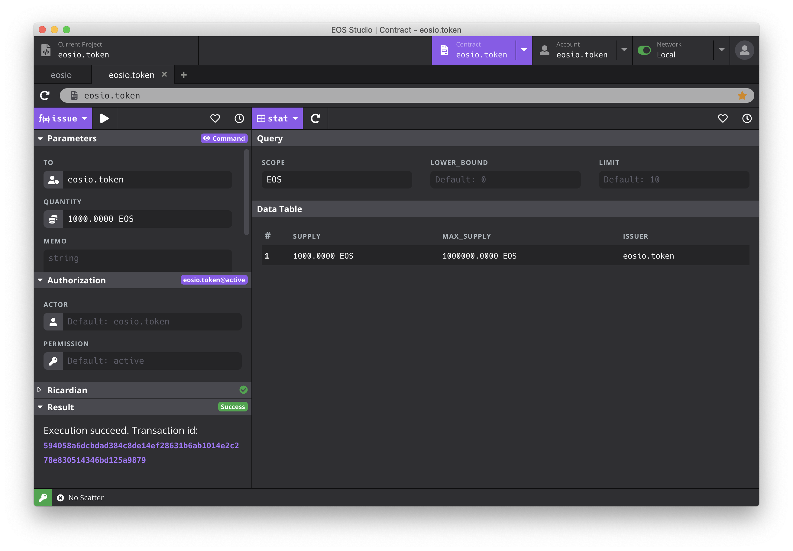

===========================================
Contract Inspector
===========================================

The Contract Page provides the necessary tools to inspect and debug
smart contracts. In order to view multiple contracts at the same time, 
EOS Studio uses tabs to support for opening multiple contracts. 
You can click on the tab to quickly switch the contract you want to view.
At the same time, the commonly used contract Account can be starred.

Just below the tabs, there is an address bar where lets you enter 
the contract account name.
EOS Studio will automatically read the abi file in the account
to check the contract based on the contract account you entered.

The EOS Studio contract inspector has two parts: 

  1) a panel to execute actions on the left, and
  2) a panel to query table data on the right.
  
In the dropdown menus at the top left for each panel, 
you can easily view all the actions and all the tables 
respectively.

If a smart contract is found in the account, EOS Studio will parse 
the abi file to visualize its actions and tables.

Actions
===========================================

Actions are shown on the right. 
You can switch the action you want to call through the dropdown menu.

-------------------------------------------
Form for Input Parameter
-------------------------------------------

A form for inputs will be generated from the abi to make
it easier to enter parameters.

The input of the action contains many types, and EOS Studio will process
the input parameters according to the type:

- For type of ``uint64_t``, ``uint32_t``, 
- For type of ``permission``, 

You can view the raw transaction command by clicking the 
`View Command` button. It will tell you what command,
including the authorization set below,
EOS Studio is going to execute when you press the `Run` button.
It will show you both the ``cleos`` command and the ``eosjs`` script.

-------------------------------------------
Authorization
-------------------------------------------

You can change the ``actor`` and ``permission`` used to sign the transaction. 
By default,
EOS Studio will use ``{account}@active`` which ``account`` is the
current selected account.

EOS Studio doesn't support multisig yet.

-------------------------------------------
Ricardian
-------------------------------------------

-------------------------------------------
Result
-------------------------------------------

The result after calling the contract will be displayed here.
If the result is, you will see the transaction hash,
click to see the complete transaction details. 

.. image:: contract/transaction_details.png

If the transaction fails, you can see
the error message.

-------------------------------------------
Execution History and Bookmarks
-------------------------------------------

When we are debugging a smart contract, we often need to call 
the same actions repeatedly, and constantly refresh the table 
to view the most recent data. Most HTTP API clients will store 
call history and have bookmarks to save common-used parameters. 
EOS Studio has these features too. Within the clock icon buttons 
on the top right for each panel, you can see the histories for 
action executions and table queries. They would be convenient 
if you need to check past execution results, or simply want to 
re-run with the same previous parameters.

EOS Studio can also save frequently used parameters to bookmarks. 
For example, if I want to issue 10 EOS to myself repeatedly, I can 
save it so I don’t need to enter them again. Go to the heart icon 
and select add to bookmarks, you will see the contract action, the 
authorizer, and parameters to execution with. Just enter a name and 
save it, and you can access it in bookmarks anytime in the future.

The record of the calling contract (including parameters and results) 
will be saved in the history for easy query.
In addition, you can add common used parameters to `bookmarks`.

Tables
===========================================

Tables are shown on the right. You can switch the table you want 
to view through the dropdown menu.
