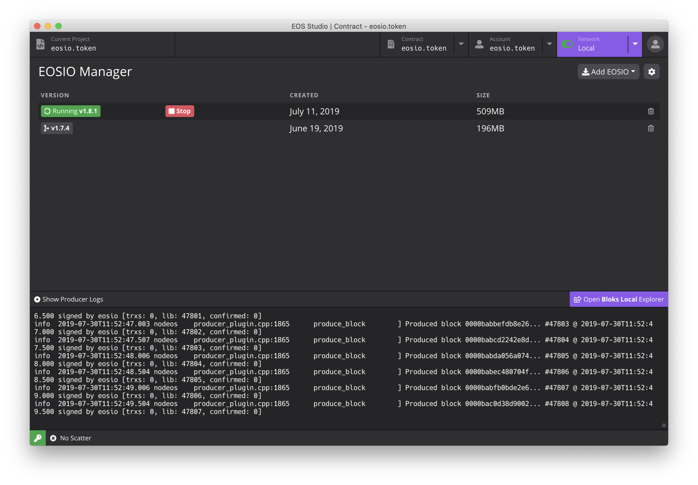

===========================================
Network Manager
===========================================

Network are use to switch connected EOSIO network.

Local Network
===========================================

(Only for EOS Studio Desktop)

-------------------------------------------
EOSIO Version Manager
-------------------------------------------

A table of installed EOSIO versions is listed here. If you want to
install another one, click the `install` button and select the version
you want to install. You can also delete unwanted versions.

To start a local network, select the version you want to start and click
the `Run` button. EOS Studio will start a docker container and 
assemble the command to run ``nodeos``. Once it is started, you can see
the block producing logs in the log terminal below.

-------------------------------------------
Advanced Configuration
-------------------------------------------

EOS Studio allow you to modify the paramters to run ``nodeos``. Click 
the `cog` button to open advanced configuration window. Here you will 
see a list of configurations, and please check ``nodeos`` documentation
to understand how to use them.

-------------------------------------------
Logs of Block Production
-------------------------------------------

You can toggle the button and hide ...

Cloud-hosted Network
===========================================

This is a for-development testnet provided by dfuse.

Remote Networks
===========================================

Other networks EOS Studio supports

- The EOSIO Mainnet
- Jungle 2.0 testnet
- CryptoKylin testnet

You can also connect to a custom networks

-------------------------------------------
Basic Information
-------------------------------------------

API Endpoints and Chian ID
-------------------------------------------

Access to Block Explorers
-------------------------------------------

-------------------------------------------
Blocks
-------------------------------------------