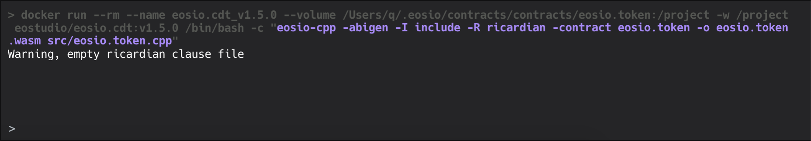

===========================================
Project Editor
===========================================

Main Components
===========================================

-------------------------------------------
Code Editor
-------------------------------------------

The code editor has integrated some of the most practical 
tools for contract development. For example, it supports 
highlight and autocompletes for EOSIO-specific syntax.

The code editor will render markdown files.

The ``README.md`` file will serve as the main page for a project.

-------------------------------------------
Toolbar
-------------------------------------------

In the toolbar menu at the top left, there are some 
handy buttons that help you easily do common operations 
such as

- New Contract:
- Build: use EOSIO.CDT to compile smart contract
- Deploy: deploy the ``wasm`` and ``abi`` files to a specific account
- Test (only for desktop): run test cases; will initialize the 
  test framework when the button is pressed for the first time
- Project Settings: open the project settings page

-------------------------------------------
File Tree
-------------------------------------------

In the file tree, you can xxx the project files.

-------------------------------------------
Terminal
-------------------------------------------

The terminal is mainly used to display EOSIO.CDT outputs
and test outputs.

Types of Projects
===========================================

-------------------------------------------
Local Project (only for desktop)
-------------------------------------------

A local project is saved on your disk.

-------------------------------------------
Remote Project
-------------------------------------------

A remote project is saved on EOS Studio's cloud service.
You can use both EOS Studio Desktop and EOS Studio Web to
access a remote project.

-------------------------------------------
Others' Shared Project
-------------------------------------------

Open projects shared by others

Code editor

Project Settings
===========================================

EOS Studio provides a Project Settings page to easily 
view and modify the .eosproj file, accessible by clicking 
the cog button in the toolbar menu. The first item defines 
the main file for the project and the compile process will 
start from this file. The second contract name item corresponds 
to the --contract attribute for CDT command line and is also 
required for compilation. The following items are optional 
and usually used for some advanced configuration in compilation. 
You can refer the CDT command line documentation to learn how 
to use them.

In the below Deployment Settings, you can specify the account 
to which you want to deploy your smart contract. EOS Studio 
supports local, Kylin and Jungle testnets, and EOSIO mainnet, 
so you can specify them separately. For example, if we enter 
newcontract in the local config line, you will see the name 
also appears next to the deploy button in the toolbar. Now if 
we click the button, EOS Studio will deploy the latest compiled 
codes to the newcontract account.
