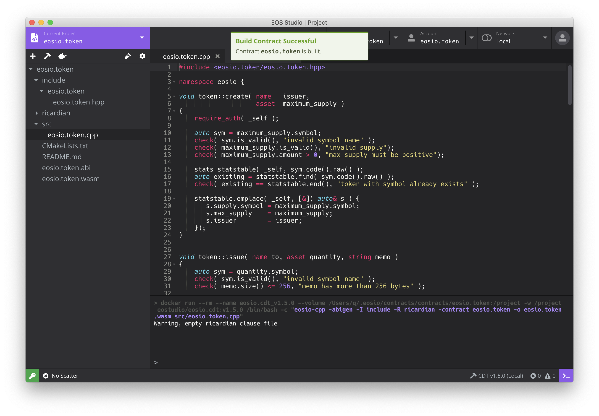

.. EOS Studio Docs documentation master file, created by
   sphinx-quickstart.

EOS Studio Docs
===========================================

EOS Studio (`<https://www.eosstudio.io>`_) is a graphical IDE for 
EOSIO dApp development. By integrating various tools required for EOSIO in 
a unified application, EOS Studio provides a powerful and easy-to-use 
environment to build dApps. 
With EOS Studio, developers can complete the whole dApp development process
from.

The key features include

- EOSIO customized code editor
- Built-in EOSIO.CDT
- Interactive contract inspector
- EOSIO version manager.

EOS Studio was first launched in Febuary 2019 and it 
quickly became the fastest and most powerful tool for EOSIO contract development.
Prior to EOS Studio, developers needed to use the command line and learn multiple
tools for contract compilation, deployment and test. Although these tools have 
provided important operability at the fundamental levels, they were not designed 
for efficiency.

EOS Studio aim to provide a powerful and easy-to-use environment for dApp development.
It not only supports basic IDE features such as code editing, but also integrates 
components for blockchain development.

The following documentation will guide you through,
as well as providing a with examples.

.. toctree::
  :maxdepth: 2
  :caption: Introduction

  getting-started/index
  eosio-fundamentals/index
  advanced/index

.. toctree::
  :maxdepth: 2
  :caption: EOS Studio Features

  eos-studio/overview
  eos-studio/project
  eos-studio/contract
  eos-studio/account
  eos-studio/network
  eos-studio/bottom

.. toctree::
  :maxdepth: 2
  :caption: Sample Smart Contracts

  contracts/eosio-token
  contracts/elemental-battles
  contracts/dgoods/index

.. toctree::
  :maxdepth: 2
  :caption: Resources

  eosio-cdt/index

Indices and tables
==================

* :ref:`genindex`
* :ref:`modindex`
* :ref:`search`
